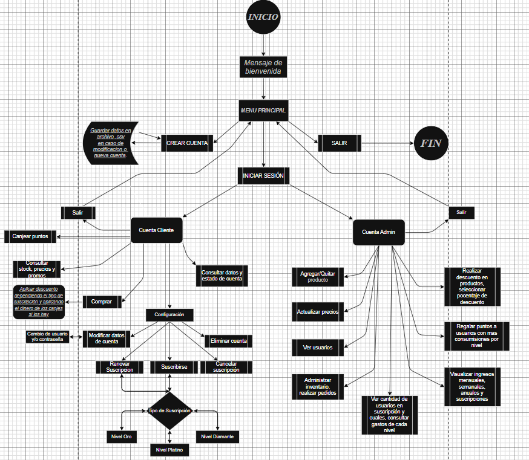

🐾 ¡Descubre PetShop Mayorista! Este prototipo, desarrollado con la robustez de Python y la simplicidad de archivos CSV, es una prueba tangible de mis conocimientos y una práctica en la creación de proyectos propios.

🌱 Como entusiasta estudiante de programación, me dediqué a construir este algoritmo desde cero, implementando estructuras de control, módulos para una organización clara del código y la manipulación de datos a través de archivos CSV. Este enfoque práctico me permitirá comprender los fundamentos del desarrollo de software.

📊 Para visualizar la lógica interna de PetShop Mayorista, diseñé un diagrama de flujo del algoritmo. Acá podrás ver su representación gráfica: 

📦 Este proyecto simula las funcionalidades esenciales de un mayorista de pet shop, permitiendo la gestión de inventario, proveedores, clientes y pedidos, todo ello sin la dependencia de bibliotecas externas complejas. Cada línea de código y cada archivo CSV representan un paso en mi camino de aprendizaje en el mundo del desarrollo.

🚀 PetShop Mayorista es más que un simple proyecto; es una demostración de mi compromiso con la programación y con la mejora continua. Espero que explorar su estructura y funcionamiento te resulte interesante. Si crees que podrías aportar con algun consejo, correción u optimización sobre el algoritmo, hazmelo saber.

Contacto:

  

